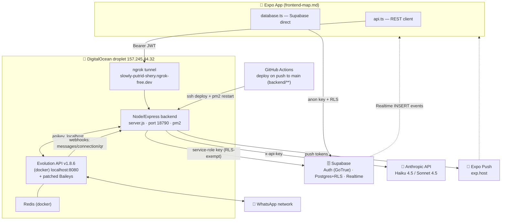
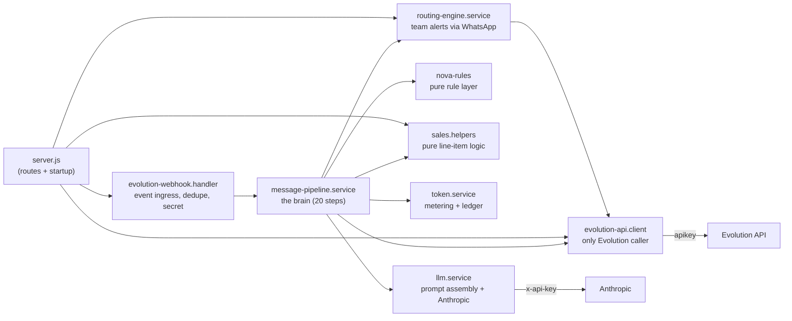
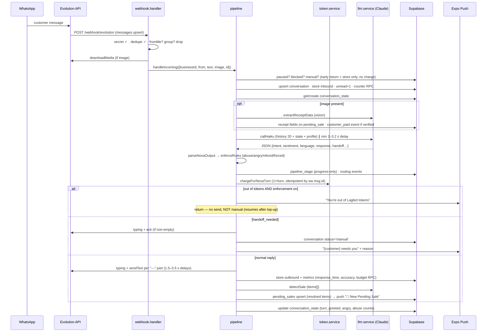

# 🖥️ Lagbot — Complete Backend Architecture Map

> Generated 2026-06-10 from `main` @ `64f0b48`. Companion to [frontend-map.md](./frontend-map.md).
> Scope: every HTTP endpoint, middleware, service, data flow, external integration, background job,
> and **every point where the backend hands data off to the frontend** (REST, Supabase-direct, Realtime, Push).
>
> **Format note:** this is Markdown + Mermaid — paste into **Notion** (Mermaid renders in code blocks) or hand
> to **Claude** as-is. For Claude analysis, keep it inside the repo: every claim carries `file:line` references
> it can chase into source.

---

## 1. System Overview (C4 context)

**The split that defines everything:** the app **reads** straight from Supabase (RLS-scoped), and sends
**actions/writes with side effects** through the backend REST API. The backend is the only thing that talks
to Evolution (WhatsApp), Anthropic (AI), and Expo Push — and it uses the **service-role key**, so every
endpoint must scope queries by `req.businessId` itself (RLS does not protect it).

---

## 2. Runtime & Deployment Topology

| Component | Where | Detail |
|---|---|---|
| Express backend | droplet, `pm2` (1 instance, cluster) | `backend/server.js`, port `18790` |
| Public ingress | ngrok static domain | `https://slowly-putrid-shery.ngrok-free.dev` → 18790 (⚠️ free tier — replacement with `api.lagbot.app` reverse proxy is a planned workstream) |
| Evolution API | droplet, docker-compose | v1.8.6 + volume-mounted Baileys patch (`evolution-patches/whatsapp.baileys.service.js`: `@lid` send support, per-instance proxy hooks) |
| Deploy pipeline | GitHub Actions | on push to `main`, path-filtered `backend/**` → ssh → pull → pm2 restart (~30 s) |
| iOS builds | Codemagic (free lane) / EAS cloud | not part of backend runtime; see memory `project_ios_builds` |
| DB / Auth | Supabase project `stvzjlyxqhgfjypjqamv` (eu-west-1) | backend uses `SUPABASE_SERVICE_KEY` |

**Startup sequence** (`server.js` bottom):
1. Hydrate in-memory `pausedBusinesses` Set from `business_config.auto_respond=false`
2. Re-register Evolution webhooks for every `whatsapp_connections.connection_status='connected'`
3. `listen(18790)`
4. Auto-archive sweep — immediately + every 24 h: conversations idle >7 days → `archived_at=now(), archived_by='auto'` (any inbound un-archives)

---

## 3. Complete HTTP Surface (33 routes)

### Cross-cutting middleware
| Layer | Behavior |
|---|---|
| CORS | allowlist from `ALLOWED_ORIGINS` env (CSV); native apps (no Origin) always pass; default deny browsers |
| Global rate limit | 100 req/min/IP (in-memory; `trust proxy: 1`) |
| Per-business rate limit | `rateLimitBusiness`: pairing-code 6/min, products-import 10/min |
| `requireAuth` (`middleware/auth.js:51`) | `Authorization: Bearer <JWT>` → `supabase.auth.getUser(token)` → sets `req.user/userId/token` |
| `requireBusiness` (`auth.js:21`) | user-JWT-scoped client reads `businesses` by `owner_user_id` → sets `req.businessId`; 404 if no business |
| `validateBody([...])` | 400 on missing required body fields |
| Error handler (`middleware/error-handler.js`) | JSON logs; generic 500 to client; stack only in non-prod; 404 catch-all `Route not found: METHOD PATH` |
| Request logger | JSON line per request (skips `/healthz`, `/api/status`, OPTIONS) |

### Routes
| # | Method | Path | Auth | What it does (services → tables) |
|---|---|---|---|---|
| 1 | GET | `/` | — | health `{name, version, status}` |
| 2 | GET | `/api/status` | — | status + `pipeline.messagesProcessed` |
| 3 | GET | `/healthz` | — | LB health `{status:'ok', supabase:'connected'}` |
| 4 | POST | `/webhook/evolution` | shared secret (header) | Evolution event ingress → webhook handler (§5) |
| 5 | POST | `/webhook/evolution/:secret` | shared secret (path) | same (secret embedded in registered URL) |
| 6 | POST | `/api/whatsapp/pairing-code` | auth+biz, 6/min | normalize NG phone → delete+recreate instance `biz_<bizId>` → set webhook → upsert `whatsapp_connections` → `startConnection` → await `qrcode.updated` waiter (30 s) → `{pairingCode}` |
| 7 | GET | `/api/whatsapp/status` | auth+biz | `whatsapp_connections` row + live `getConnectionState` → `{connected, state, phoneNumber}` |
| 8 | POST | `/api/whatsapp/send` | auth+biz | owner sends manual message: `sendText` + best-effort insert `messages` (outbound/human) |
| 9 | POST | `/api/whatsapp/disconnect` | auth+biz | `disconnectInstance` (logout, instance kept) |
| 10 | POST | `/api/test/push` | auth+biz, non-prod only | test Expo push to own token |
| 11 | POST | `/api/ai/pause` | auth+biz | `pausedBusinesses.add` + `business_config.auto_respond=false` + LLM cache invalidate |
| 12 | POST | `/api/ai/resume` | auth+biz | inverse of pause |
| 13 | POST | `/api/settings/refresh` | auth+biz | LLM profile-cache invalidate (after settings save) |
| 14 | GET | `/api/dashboard/message-count` | auth+biz | `message_count_realtime` view |
| 15 | GET | `/api/dashboard/ai-accuracy` | auth+biz | latest `ai_accuracy_metrics` |
| 16 | GET | `/api/dashboard/recent-conversations` | auth+biz | 10 conversations + last 4 messages each |
| 17 | GET | `/api/dashboard/budget` | auth+biz | today's `budget_tracking` |
| 18 | GET | `/api/stats` | auth+biz | `daily_stats` + `budget_tracking` + `response_time_metrics` + uptime |
| 19 | POST | `/api/auth/signup` | body-validated | `auth.signUp` + `businesses` + `user_profiles` |
| 20 | POST | `/api/auth/create-business` | auth | idempotent business+`business_config` create (social-login path) |
| 21 | POST | `/api/auth/login` | body-validated | `signInWithPassword` + businessId lookup |
| 22 | GET | `/api/auth/me` | auth | profile + businessId |
| 23 | POST | `/api/account/delete` | auth | **App Store 5.1.1(v)**: delete Evolution instance (best-effort) → delete `businesses` (all tenant tables CASCADE) → delete `user_profiles` → `auth.admin.deleteUser` |
| 24 | GET | `/api/sales/pending` | auth+biz | `pending_sales` status=pending |
| 25 | GET | `/api/sales/confirmed` | auth+biz | `pending_sales` status=confirmed, period filter |
| 26 | POST | `/api/sales/:id/confirm` | auth+biz | **the only place stock decrements** (§6.3): idempotent pending→confirmed → conversation `pipeline_stage='Paid'` → `itemsForDecrement` → RPC `decrement_product_stock` per line item → low-stock push + `stock_low` routing event |
| 27 | POST | `/api/products/import` | auth+biz, 10/min, multer 10 MB | CSV (csv-parse) / Excel (XLSX, proto-pollution-stripped) / PDF (text → **Claude Haiku** extraction) → normalized product rows + per-row errors (preview only; insert happens client-side via `products.create`) |
| 28 | POST | `/api/routing-rules` | auth+biz | insert `routing_rules` |
| 29 | PATCH | `/api/routing-rules/:id` | auth+biz | patch rule |
| 30 | DELETE | `/api/routing-rules/:id` | auth+biz | delete rule |
| 31 | PATCH | `/api/conversations/:id/archive` | auth+biz | set/clear `archived_at`, `archived_by='user'` |
| 32 | POST | `/api/conversations/:id/smart-replies` | auth+biz | manual-mode threads only, customer-spoke-last only → `llm.generateSmartReplies` (last 12 msgs) → 3 drafts |
| 33 | GET | `/api/wallet` | auth+biz | ⚠️ **stub** — wallet row + zero balances + `[]` transactions (Paystack pending) |

---

## 4. Service Layer

| Service | Role | Key methods (line) |
|---|---|---|
| `evolution-api.client.js` | sole Evolution HTTP wrapper; instance naming `biz_<businessId>`; 15 s timeout | `createInstance`:29 · `startConnection`:57 · `getConnectionState`:66 · `disconnectInstance`:75 · `deleteInstance`:83 · `setWebhook`:102 (embeds secret in URL) · `sendText`:131 (keeps `@lid`) · `sendTyping`:148 (skips `@lid`) · `downloadMedia`:170 |
| `evolution-webhook.handler.js` | event ingress; **timing-safe** secret compare; in-memory idempotency (`seenMessages`, 10 k cap); drops `fromMe`/groups/broadcasts; normalizes JIDs (`@s.whatsapp.net→@c.us`, `@lid` kept) | `messages.upsert`:91 → `pipeline.handleIncoming` · `qrcode.updated`:151 → resolves pairing waiter · `connection.update`:164 → upserts `whatsapp_connections` |
| `message-pipeline.service.js` | per-message orchestration (§5) | `handleIncoming`:28 + helpers `_detectSale`:369 · `_detectSaleFromHistory`:465 · `_verifyReceipt`:544 · `_sendPush`:731 · `_getOrCreateConvState`:742 · `_updateConvState`:758 · `_setPipelineStage`:798 (progress-only Lead→Quoted→Paid) · `_trackBudget`:818 |
| `llm.service.js` | prompt assembly + all Anthropic calls; 30 s profile cache (`invalidateCache`:567) | `callHaiku`:292 (10 s) · `callSonnet`:296 (30 s) · `detectSale`:300 (8 s, **items[] output**) · `generateSmartReplies`:385 (8 s) · `extractReceiptData`:438 (15 s, vision) · `_buildSystemPrompt`:144 (identity→voice→role→product rules→playbook→inventory→bank→skills→state→JSON output) |
| `nova-rules.js` | pure, shared with `sim/`; parse + enforce | `parseNovaOutput`:18 (parse-fail → safe handoff ack) · `detectForcedHandoff`:51 (refund/fraud/legal regex on raw text) · `enforceRules`:67 (abuse tiers: mild de-escalate ×2 → silent handoff; severe immediate; angry ×2 → handoff; complaint/refund always; close-attempt dedupe) |
| `sales.helpers.js` | pure, shared with confirm endpoint; tested in `backend/sales.selftest.js` | `normalizeDetectedItems`:15 · `clampQty`:31 · `resolveItems`:40 (exact→ci match → `product_id`) · `summarizeItems`:60 ("7× Lamborghini, 11× Ferrari") · `itemsForDecrement`:78 (linkedProductId > items[] > legacy name match) |
| `token.service.js` | Phase-1 metering: BASE 30 / EXTRA 10 per ≤24 h session; 500 free/day, lazy Lagos-midnight refill; buckets free→rolled→bonus→purchased; `(charge_key,bucket)` idempotency; `enforcement_enabled=false` (meter-only) | `getConfig`:53 (60 s cache) · `getOrCreateState`:75 · `refillFreeTokensIfDue`:100 · `chargeForNovaTurn`:124 |
| `routing-engine.service.js` | team alerts: events → enabled `routing_rules` → resolve person/role → render `{placeholders}` → `sendText` to member WhatsApp; per-fire dedupe | `fireEvent`:37 · events: `order_ready_for_delivery, customer_paid, customer_refund, customer_complaint, quote_requested, stock_low, new_enquiry, after_hours` |
| `file-parser.js` | ⚠️ **dead code** — superseded by inline parsing in `/api/products/import` | — |
| `backend/prompts/SYSTEM_CORE.md` | ⚠️ legacy reference doc, not imported | — |

---

## 5. The Core Flow: Inbound WhatsApp Message → Reply

Failure backstop: any throw in the pipeline → fallback text "Sorry, having a small issue…" (never billed, never stored).

---

## 6. Other Critical Flows

### 6.1 WhatsApp pairing
`POST /api/whatsapp/pairing-code` → delete+recreate `biz_<id>` instance → `setWebhook` (secret in URL) →
register waiter in `pairingCodeWaiters` Map → `startConnection` → Evolution fires `qrcode.updated` →
waiter resolves pairing code → response. `connection.update` events keep `whatsapp_connections` in sync.

### 6.2 Receipt verification (image → money)
Image arrives → `extractReceiptData` (Claude vision) → normalize + compare against `business_config.bank_details`
(account name/number, amount ±5%) → mark `pending_sales.receipt_verified` + fill missing `amount` →
`customer_paid` routing event. **Never decrements stock, never auto-confirms** — owner confirms in the app.

### 6.3 Sale confirm + inventory decrement (single source of truth)
`POST /api/sales/:id/confirm` → idempotent status flip (re-confirm = no-op) → `itemsForDecrement`
(UI override > `items[]` with detection-time `product_id`s > legacy name match exact>ci>substring) →
`decrement_product_stock(p_id, p_qty)` RPC per line item (atomic, clamps ≥0, syncs `in_stock`) →
low-stock push + `stock_low` event at ≤2.

### 6.4 Token charge
One charge per Nova **turn** (multi-bubble reply = 1 charge). BASE 30 if >24 h since `last_nova_charge_at`,
else EXTRA 10. Ledger (`token_ledger`) is source of truth; `vendor_token_state` is the cache; unfunded
remainder logged as `overage` while `enforcement_enabled=false`.

### 6.5 Account deletion (5.1.1(v))
Evolution instance delete (best-effort) → `businesses` delete (every tenant table is `ON DELETE CASCADE`) →
explicit `user_profiles` delete (no cascade) → `auth.admin.deleteUser`. Verified end-to-end: re-login fails.

---

## 7. Data Layer (Supabase Postgres)

| Table / object | Written by | Read by | Notes |
|---|---|---|---|
| `businesses` | backend (signup/create/delete), app (`business.update`) | everything | tenant root; all FKs cascade from here |
| `business_config` | app (settings upserts), backend (pause/resume, push token) | pipeline, LLM profile | `auto_respond`, `bank_details`, `blocked_contacts`, `push_token`, tone… |
| `whatsapp_connections` | webhook handler, pairing endpoint | status endpoint, startup re-registration | `biz_<id>` instance names |
| `conversations` | pipeline (upsert/status/stage/archive), app (unread/status) | app (chats), dashboard endpoints | unique `(business_id, customer_phone)`; `@lid` JIDs live here |
| `messages` | pipeline (in+out), `/api/whatsapp/send` | app (threads + **Realtime**), smart-replies | cost/tokens/latency per AI message |
| `conversation_state` | pipeline | pipeline, prompt injection | turn/greeted/deferred/close/angry/`abuse_count`/language |
| `pending_sales` | pipeline (detect+receipt), confirm endpoint | app (sales), confirm | **`items` jsonb** = line items with `product_id` (sql/016) |
| `confirmed_sales` | (receipt-era legacy path) | revenue cards | amount-only |
| `products` | app CRUD, confirm endpoint (via RPC) | LLM inventory block, app | soft-delete `active=false` |
| `vendor_token_state` / `token_ledger` / `token_config` | token.service only (service role) | app reads state+config (RLS SELECT-only) | sql/014; `(charge_key,bucket)` unique |
| `routing_rules` / `team_members` | app + routing endpoints | routing engine | role fan-out |
| `user_skills` / `skills` | app | LLM skills block | max 3 active (app-enforced) |
| metrics: `response_time_metrics`, `ai_accuracy_metrics`, `budget_tracking`, `daily_stats`, `human_interventions`, `customer_satisfaction` | pipeline | analytics screens, dashboard endpoints | |
| `user_profiles` | signup, account-delete | `/api/auth/me` | **no cascade from auth.users** — deleted explicitly |
| view `message_count_realtime` | — | dashboard | incl. `all_time_count` |
| RPCs | `decrement_product_stock` (sql/012, atomic) · `increment_budget` (sql/014) · `increment_message_count` · `calculate_ai_accuracy` | | |
| RLS | owner-scoped `auth_business_id()` on tenant tables; token tables SELECT-only; **backend bypasses RLS via service key → endpoints must filter by `req.businessId`** | | sql/002, 014, 015 hardening |

---

## 8. External Integrations

| System | Endpoint(s) | Auth (env) | Timeouts | Callers |
|---|---|---|---|---|
| Anthropic | `POST /v1/messages` — `claude-haiku-4-5-20251001` (replies, detectSale, smart replies, receipt vision, PDF import), `claude-sonnet-4-5` (escalation tier) | `ANTHROPIC_API_KEY` | 8–30 s + AbortController, no retry; **prompt caching on** | llm.service, products/import |
| Evolution API | `/instance/*`, `/webhook/set`, `/message/sendText`, `/chat/sendPresence`, `/chat/getBase64FromMediaMessage` | `EVOLUTION_API_KEY` (localhost) | 15 s axios | evolution-api.client only |
| Supabase | PostgREST + Auth admin | `SUPABASE_SERVICE_KEY` | client defaults | all services |
| Expo Push | `POST exp.host/--/api/v2/push/send` | none (token-addressed) | fire-and-forget | pipeline `_sendPush`, confirm endpoint, test |
| Paystack | — | — | — | ⚠️ not integrated (wallet stub, token-store endpoint missing) |

**Env vars:** `SUPABASE_URL` · `SUPABASE_SERVICE_KEY` · `SUPABASE_ANON_KEY` · `ANTHROPIC_API_KEY` ·
`EVOLUTION_API_URL` · `EVOLUTION_API_KEY` · `EVOLUTION_WEBHOOK_SECRET` · `WEBHOOK_BASE_URL` · `PORT` ·
`ALLOWED_ORIGINS` · `NODE_ENV`

---

## 9. The Handoff: Where the Backend Meets the Frontend

### 9.1 REST bridge (api.ts → backend)
| api.ts method | Endpoint | UI trigger |
|---|---|---|
| `getWhatsAppStatus` | GET `/api/whatsapp/status` | chats header poll (30 s), onboarding |
| `requestPairingCode` | POST `/api/whatsapp/pairing-code` | onboarding step 5, settings connect |
| `disconnectWhatsApp` | POST `/api/whatsapp/disconnect` | settings Disconnect |
| `sendMessage` | POST `/api/whatsapp/send` | chat composer Send, sales "Push to Team" |
| `pauseAI` / `resumeAI` | POST `/api/ai/pause|resume` | dashboard Lagbot toggle |
| `refreshSettingsCache` | POST `/api/settings/refresh` | every settings Save |
| `deleteAccount` | POST `/api/account/delete` | settings Danger Zone |
| `suggestReplies` | POST `/api/conversations/:id/smart-replies` | chats SmartReplyStrip |
| `create/update/deleteRoutingRule` | `/api/routing-rules*` | sales Teams editor |
| `archiveConversation` | PATCH `/api/conversations/:id/archive` | chat row swipe |
| `pendingSales.confirm` | POST `/api/sales/:id/confirm` | sales Confirm Sale button |
| raw fetch | POST `/api/products/import` | product import (FormData) |
| `initTokenPurchase` | POST `/api/tokens/purchase/init` | ⚠️ **backend route doesn't exist yet** (UI fails soft) |

### 9.2 Supabase-direct (database.ts — backend not involved; RLS is the boundary)
Reads: conversations+messages, products, sales (pending/confirmed), team_members, routing_rules,
business+config, `vendor_token_state`/`token_config`, skills, all analytics tables.
Writes (simple CRUD): products, team_members, business/business_config upserts, skills toggle,
conversation `status`/`unread_count`.

### 9.3 Realtime (Supabase → app, no backend hop)
| Channel | Event | Consumer |
|---|---|---|
| `messages-changes` | INSERT on `messages` | conversations list invalidation |
| `thread-${conversationId}` | INSERT filtered by conversation | live thread append |

### 9.4 Push notifications (backend → app, deep-linked)
| Push | Sent from | `data` payload → app route |
|---|---|---|
| New message (paused/manual) | pipeline early-returns | `{conversationId, customerPhone}` → `/(tabs)/chats?...` |
| "{customer} needs you" + handoff reason | handoff branch | conversation deep link |
| 🛒 New Pending Sale / receipt verified | `_detectSale` / receipt path | `{screen:'sales'}` → `/(tabs)/sales` |
| ⚠️ Low Stock | confirm endpoint | `{screen:'inventory'}` → `/(tabs)/inventory` |
| Out of Lagbot tokens | token block (enforcement on) | `{screen:'tokens'}` |

### 9.5 Auth flow
App holds Supabase session (AsyncStorage `sb-*`) → `getAuthHeader()` attaches `Bearer <access_token>` to every
REST call → `requireAuth` verifies via `auth.getUser(token)` → `requireBusiness` maps user→business with the
**user's own JWT** (RLS-checked) → handlers then use the service-role client scoped by `req.businessId`.

---

## 10. Known Gaps & Stubs (as of 64f0b48)

| Item | Status |
|---|---|
| `GET /api/wallet` | stub — zero balances; real Paystack wallet is Phase 3 |
| `POST /api/tokens/purchase/init` + Paystack webhook | **missing** — token-store UI ships but fails soft; Phase 2 next |
| `POST /api/wallet/withdraw` | called by wallet UI, no backend route |
| `api.initializeWhatsApp` → `/api/whatsapp/qr` | dead code both sides |
| `backend/services/file-parser.js`, `backend/prompts/SYSTEM_CORE.md`, `backend/routes/` (empty) | dead/legacy — candidates for deletion |
| ngrok free tunnel as prod ingress | planned replacement: Caddy/nginx + `api.lagbot.app` |
| Token enforcement | metering live, `enforcement_enabled=false` until numbers reviewed |
| WhatsApp per-tenant proxies | planned (see `whatsapp-proxy-plan.md`) |

---

*Maintenance: regenerate when routes/services change materially; update the commit hash in the header. The
sim harness (`sim/`) and selftests (`backend/*.selftest.js`) exercise the rule layer, token math, and sales
helpers documented above.*
